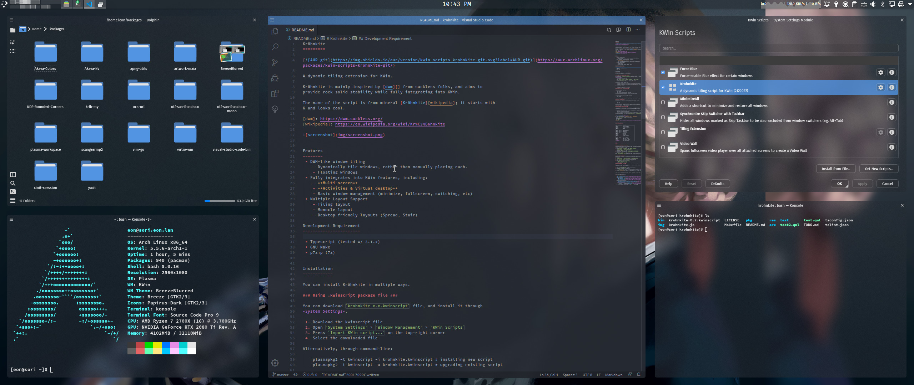

[KDE] Blur & Blur
=================

This repo contains some of the files used to produce the following:

... which I posted on [reddit][].

[reddit]: https://www.reddit.com/r/unixporn/comments/fcca54/kde_blue_blur/

This Repo Provides
------------------

 * **FlatBlur-SoftBlue**: Modified [FlatBlur][] theme
 * **SoftBlue color**: Modified [Akava][] color theme

[FlatBlur]: https://store.kde.org/p/1326672/
[Akava]: https://github.com/Akava-Design/Akava-Colors

Other Elements
--------------

 * [Kvantum](https://store.kde.org/p/1005410/) engine
 * WM Theme: [BreezeBlurred](https://store.kde.org/p/1221562/)
 * Icon: [Papirus-dark](https://github.com/PapirusDevelopmentTeam/papirus-icon-theme)
 * Bar: [Latte Dock](https://store.kde.org/p/1169519/)
 * KWin tiling script: [Krohnkite](https://github.com/esjeon/krohnkite)

About the Dolphin window...
---------------------------

You can actually move the main toolbar of Dolphin. I simply move the bar to the
left-side of the window.

To do this, just right-click on the bar to show context menu, and unlock the bar.
Drag the bar to where you want it to be, and lock it back. Simple.

